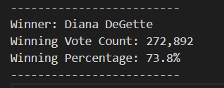

# Overview of Election Audit #

We are assisting a Colorado Board of election employee Tom, in an election audit of tabulated results of a US congressional precinct in Colorado. The task is to generate a report consisting of the below-mentioned information -
1. Total no of Votes cast.
2. Total number of votes cast for each candidate.
3. % of votes cast for each candidate.
4. Winner of the election based on the popular vote.

This task is usually done in excel but at the request of Tom's manager Seth, we are helping Tom in automating this process using python.

Python is used in many fields such as Finance, Health Care, and Weather Forecasting to name a few.
It has several different libraries that help us Access, Process, manipulate, and store data.

We have used command line, to make updates to the GitHub repository, access local files and folders, and write and run Python programming scripts in order to help Tom with the election analysis.
We have used Python interpreter as well as Visual Studio Code for writing and executing Python scripts.

Once automated this code can not only be used in assessing the results of other congressional districts but also senatorial districts and local elections.

Seth and Tom submitted the election audit results to the election commission. But The election commission came back  requesting some additional data to complete the audit:

* The voter turnout for each county
* The percentage of votes from each county out of the total count
* The county with the highest turnout

So we went back and ehanced our existingpythin script to fetch these details as well from the given data set.

# Election-Audit Results #

After completing the analysis of the data given, we have reached on certain conclusion as explained below:

### 1. How many votes were cast in this congressional election? ###

The total number of votes cast in the conressional election was : **369,711**

---
</img>

---

### 2. Total number of votes and the percentage of total votes for each county in the precinct. ###

We can see that Denver accounted for around 82 % of the total votes cast. While county Jefferson as Arapahoe were distant 2nd and 3rd respectively.

---
</img>

---

### 3. Which county had the largest number of votes? ### 

As we saw from the previous image that the **Denver** county accounted for around 82% of total votes cast.

---
</img>

---

### 4. Provide a breakdown of the number of votes and the percentage of the total votes each candidate received.### 

Below image represents the breakdown of voteshare among the candidates.

---
</img>

---

### 5. Which candidate won the election, what was their vote count, and what was their percentage of the total votes?### 

As we counted the votes and completed all analysis, there was a clear mandate in favor of **Diana DeGette** as she received almost 3/4th of the total votes cast.

---
</img>

---

# Summary #

The analysis of the data set given presented us with the below pieces of information:

* Totalo no. of votes - **369,711**
* Candidates -
    * Charles Casper Stockham
    * Diana DeGette
    * Raymon Anthony Doane
* Counties part of election -
    * Arapahoe
    * Denver
    * Jefferson
* County which influenced the result most -
    * Denver - **~82%** of total votes cast were from this count.

* Result if Election
    * **Diana DeGette** is the winner of the election as she received 3 of 4 votes cast.

While this analysis fulfills the current requirement of judging the performance of candidayes in the election, we can get more  more insgiht out of the given data set with some modifications in the current python script.
Such as we could find which county voted in favour of which candidate.

Also by looking on to the preference of voters (no of votes cast to each candidate in a county) we can analyse if a county is voting en bloc or there is a diverse opinion about the candidate.
